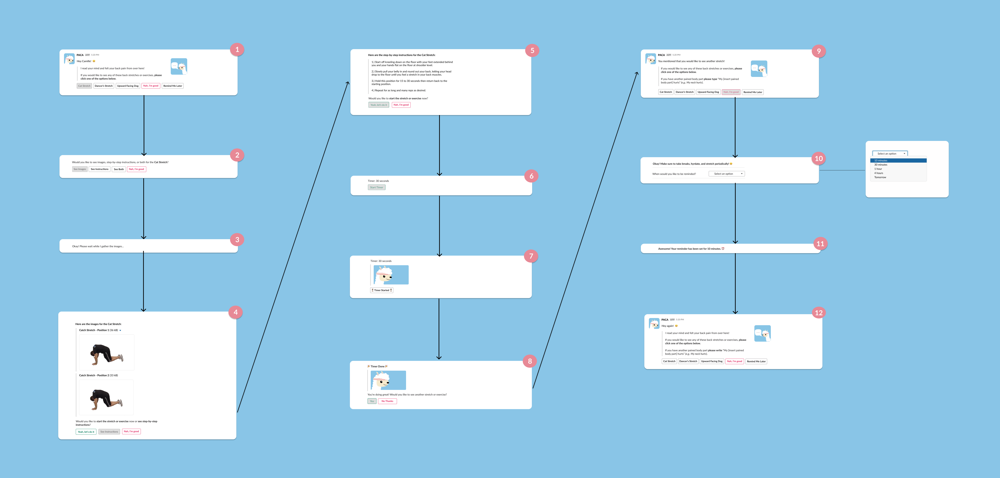

# PACA Long Description

Here are more details and information that is not included in our [README.md](README.md) 

## Design Rationale

## Example User Flow

### Example User Path Description 

1. This is an example of a direct message a user receives whenever they mention any body pain such as “back pain” or “my back hurts” on Slack. The user has the option to choose between three stretches or exercises, to reject the recommendations, or to receive a reminder later. 

2. If a stretch is chosen (like the “Cat Stretch”), then PACA will ask the user if they would like to see images, instructions, or both at the same time. There is also an option to reject seeing any of them.

3. If the user chooses to “See Images” then Message #2 will be replaced with Message#3, asking the user to wait while PACA retrieves the images from the database.

4. In this message, each image title is bolded while the images are sent out as attachments. After receiving the images, the user can either start the exercise, see instructions, or to reject all options.

5. If the user chooses to “See instructions” then PACA will send the stretch or exercise’s step-by-step instructions. The user can then start the exercise or to reject all options. 

6. When the user chooses to start the exercise, they will be sent a line of text which tells them how long the timer will be for the stretch or exercise and a button to start the timer. 

7. Once the user starts the timer, they will be sent a GIF and the timer will start counting down. 

8. Once the timer is done, the user will be asked if they would like to see another stretch or exercise.

9. If the user chooses “Yes”, then Message #9 will be sent. This message restates that the user wanted to see another stretch or exercise and informs them to choose another option from the buttons or to type out a specific statement if another body part is hurting. 

10. If the user chooses to reject all options by clicking or pressing “Nah, I’m good” then the user will be told to “make sure to take breaks, hydrate, and stretch periodically!”. The bot will also ask the user if they would like to be reminded to stretch at a later time. 

11. After the user chooses from the 5 options, they will be sent a confirmation message with the options they have chosen. 

12. This is the reminder message the user will be sent which is similar to Message #9. 
