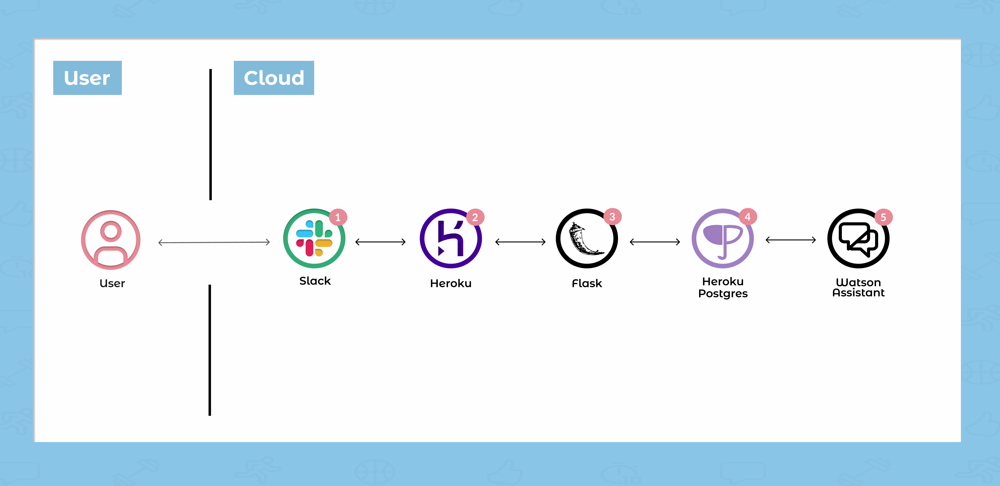

#  

## Short Description

PACA is a Slack application that uses IBM Watson Assistant to detect messages about body pain and then send a direct message to the pained user to provide them with recommended stretches and exercises. If a user is not available at the time to do the stretch or exercise, they can use PACA’s reminder feature to be reminded at a later time. The goal of this application is to ease remote workers’ body pain as they work from undisciplined work environments and encourage them to stretch or exercise more throughout the day. 
 
 

## Contents
1. [Short Description](#short-description)
1. [PACA Story](#paca-story)
1. [The Architecture](#the-architecture)
1. [Long Description](#long-description)
1. [Project Roadmap](#project-roadmap)
1. [Getting Started](#getting-started)
1. [Built With](#built-with)
1. [Contributing](#contributing)
1. [Versioning](#versioning)
1. [Authors](#authors)
1. [License](#license)
1. [Acknowledgments](#acknowledgments)

## PACA Story

Watch the video below to understand PACA’s solution and how it can help remote workers like Marcus: 

https://www.youtube.com/watch?v=CHB8kZkMnWY

## The Architecture

## Long Description 
Real-world problem we identified
Due to the spread of COVID-19, many workers are practicing social distancing through working from home. As more workers are now on the computer for longer hours, they tend to neglect their physical well-being. Oftentimes while working on the computer, body pain is noticed but quickly ignored and dismissed. However, ignoring the pain and not addressing it will only make it worse. Those working from home need to be reminded and shown quick exercises and stretches for specific aching body parts throughout the workday!

The technology project we created
Companies and organizations have moved most of their work communications onto Slack. PACA is a Slack application using Python programming language and IBM Watson Assistant to detect keywords in a conversation that relates to pain of a specific body part. During a conversation in a Slack channel, if a message contains words involving body part pain, PACA will directly message the user and show recommended stretches and exercises.

Explain why it is better than any existing solution
PACA monitor and detect real-time Slack channel messages related to aching of a body part. There are other health and wellness Slack applications that remind you to take breaks, but they do not provide the user actual actionable tasks that specifically target body pain. PACA will show exercises and stretches that can be accomplished quickly during the workday.

[More detail is available here](DESCRIPTION.md)

## Project Roadmap

 

## Getting Started

These instructions will get you a copy of the project up and running on your local machine for development and testing purposes. Please see [SETUP.md](SETUP.md)

## Prerequisites

Before you begin, you’ll need the following: 

* A [Slack](https://slack.com/get-started#/) account. 
* An [IBM Cloud](https://cloud.ibm.com/registration) account. 
* Heroku 
* Flask

### Slack
1. Slack Event Adapter

## Built With

* [Python](https://www.python.org/) 
* [IBM Watson Assistant](https://www.ibm.com/cloud/watson-assistant/) 
* [Slack Events API](https://github.com/slackapi/python-slack-events-api)
* [Heroku](https://www.heroku.com) 
* [Heroku Postgres](https://www.heroku.com/postgres)
* [Flask](https://flask.palletsprojects.com/en/1.1.x/)
* [Ngrok](https://ngrok.com)

## Contributing

Please read [CONTRIBUTING.md](CONTRIBUTING.md) for details on our code of conduct, and the process for submitting pull requests to us.

## Versioning

We use [SemVer](http://semver.org/) for versioning. For the versions available, see the [tags on this repository](https://github.com/your/project/tags).

## Authors

* **Geordan Banks**
* **Marcus Chan**
* **Camille Kae Valerio**

## License 
This project is licensed under the Apache 2 License - see the [LICENSE](LICENSE) file for details.

## Acknowledgments

* [Ryan Engaling](https://www.instagram.com/love.ryanalexander) for his video production 
* Yu Chen & San Jose State University 

